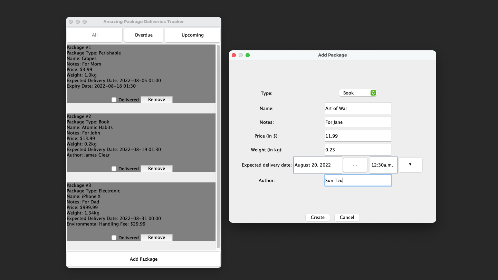

# package-tracker

A package deliveries tracker to store packages information and show the packages based on its status (All, Overdue, Upcoming). The packages information is stored in the server and uses Spring to fetches/ updates the data. Received full grade in the last iteration.

Stack: Java Swing, GSON, Spring
